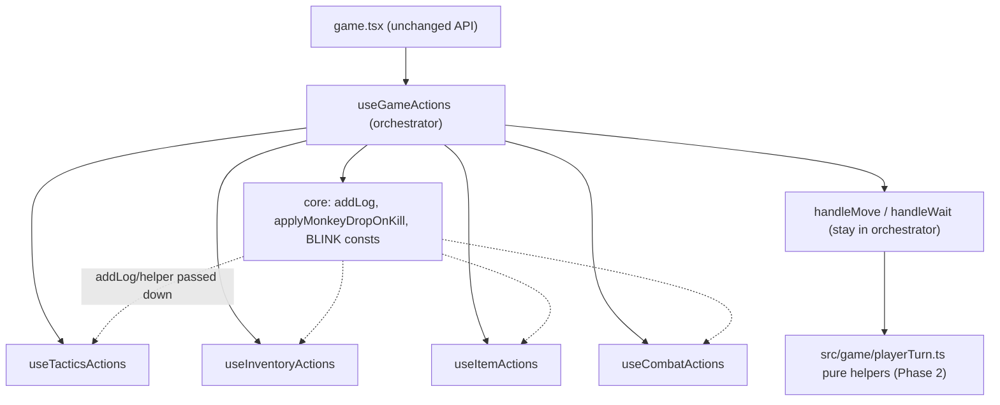

## Refactor `useGameActions.tsx` into composed sub-hooks

### 1. Major logical sections (current structure)

`[src/hooks/useGameActions.tsx](src/hooks/useGameActions.tsx)` is one hook returning 22 callbacks. Approximate line spans:

- Shared core: `addLog` (79-84), `applyMonkeyDropOnKill` (88-95), constants `BLINK_ACTIVE`/`BLINK_CD` (76-77)
- Turn/movement: `handleMove` (97-1088, ~991 lines), `handleWait` (1090-1276), `handleCloseDoor` (1278-1302)
- Consumables/items: `handleUseHeal` (1304-1374), `handleCook` (1376-1411), `handleUseRope` (1604-1719), `handleUseSlot` (1721-1881)
- Tactics/class modes: `applyWizardMode` (1413), `handleCycleRangedTarget` (1447), `applyNinjaMode` (1466), `toggleAutoStealth` (1473), `applyRangerMode` (1496), `handleCowboyTactics` (1519)
- Combat abilities: `handlePlantBomb` (1538), `handleFireProjectile` (1553), `handleBlinkStrikeOnTarget` (2095), `handleBlinkStrike` (2208)
- Inventory mgmt: `handleBankMove` (1883), `handleConsumeBankItem` (1948), `handleEquip` (2033), `handleUnequip` (2079)

Note: `handleMove` alone is ~45% of the file.

### 2. Coupling analysis

- Almost every callback closes over `addLog` + `setGameState` (the shared core).
- `applyMonkeyDropOnKill` is a shared helper used by all kill paths (`handleMove` melee, `handleWait` bolt, `handleFireProjectile`, `handleBlinkStrike`/`OnTarget`).
- `handleUseSlot` directly depends on `handleUseRope` (its dep array lists it) — must stay together.
- `handleUseSlot` <-> `handleFireProjectile` are only loosely coupled via `dirPickMode` ref/setter (no direct call), so they can live in different sub-hooks.
- `handleBlinkStrike` and `handleBlinkStrikeOnTarget` are a cohesive pair with duplicated targeting/strike logic; neither calls the other.
- The kill-reward / level-up block (`maxMana` bump, XP, drops) is inlined ~5 times across `handleMove`, `handleWait`, `handleBlinkStrike*` — strong duplication, but woven into `setGameState` updaters (high risk to extract).
- Both `handleMove` and `handleWait` end with the same pipeline `withVisibility(applyEnemyTurns(midState, runEnemyTurns(midState)))`; the enemy-turn engine is already modular in `[src/game/enemyTurns.ts](src/game/enemyTurns.ts)`.

### 3. Proposed structure

Keep `useGameActions` as a thin orchestrator that owns the shared core and composes sub-hooks, returning the exact same object shape (so `[src/pages/game.tsx](src/pages/game.tsx)` is untouched).

Sub-hook grouping:
- `useTacticsActions`: applyWizardMode, handleCycleRangedTarget, applyNinjaMode, toggleAutoStealth, applyRangerMode, handleCowboyTactics
- `useInventoryActions`: handleBankMove, handleConsumeBankItem, handleEquip, handleUnequip
- `useItemActions`: handleUseHeal, handleCook, handleUseRope, handleUseSlot (rope+slot kept together)
- `useCombatActions`: handlePlantBomb, handleFireProjectile, handleBlinkStrikeOnTarget, handleBlinkStrike (receives `applyMonkeyDropOnKill`)
- Stays in orchestrator for now: handleMove, handleWait, handleCloseDoor

Each sub-hook signature mirrors the parent: `useXActions({ ...refs, ...setters, addLog, applyMonkeyDropOnKill? })`. Constants `BLINK_ACTIVE`/`BLINK_CD` are simple literals — redeclare per file.

### 4. Safest extraction order

Lowest-coupling first; verify `npm run typecheck` + `npx vite build` green after each step (this is the regression gate, since logic is only moved, not changed):

1. `useTacticsActions` (6 small, near-independent callbacks)
2. `useInventoryActions` (bank/equip — self-contained)
3. `useItemActions` (keep handleUseSlot+handleUseRope pair intact)
4. `useCombatActions` (pass `applyMonkeyDropOnKill` down)

### 5. Risk assessment (critical: the "duplication" is not clean)

Inspecting the actual kill paths shows they are NOT identical, so Phase 2 helpers must be carefully parameterized, not naive copy-merges:

- Melee path in `handleMove` (~627-730) has melee-only logic absent from the bolt path: lightning-bolt arc, ninja combo, vampiric strike, heal-on-kill, dodge-heal, thorns reflect, damage-taken mood penalty.
- Wizard-bolt path in `handleWait` (~1147-1214) has bolt-only logic absent from melee: mana spend, beam-visual computation.
- Turn tails differ: melee returns `applyEnemyTurns(newState, runEnemyTurns(newState, skipFightId))` (no visibility wrap, uses `skipFightId`); wait returns `withVisibility(applyEnemyTurns(midState, runEnemyTurns(midState)))`.

Risk tiers:
- LOW / safe to share: `applyOverhealDecay()` (near-identical in both), `endPlayerTurn()` turn-tail (parameterize `skipFightId` + optional visibility wrap).
- HIGH: `applyKillRewards()` (XP + level-up + maxMana bump + drops) and `applyClassAutoBehaviors()` (wizard/ranger/cowboy/ninja autofire). These touch RNG-heavy combat math across 5 classes with only manual playtest as a check unless tests exist.

### 6. Agreed approach (full Phase 2, gated by tests)

Phase 1 = mechanical sub-hook split (no tests needed; typecheck+build+playtest is sufficient since logic only moves). Phase 2 = pure-helper decomposition, with a Vitest unit-test safety net added before the HIGH-risk combat-math dedup. `usePlayerTurn.ts` hook wrapper is dropped (low marginal value once pure helpers exist). Test framework choice finalized after Phase 1.

### 7. Step-by-step plan

Phase 1 (verify `npm run typecheck` + `npx vite build` green after each step):
1. Create `src/hooks/actions/useTacticsActions.ts`; move the 6 tactics callbacks verbatim; accept needed refs/setters + `addLog`; orchestrator calls it and spreads into the return.
2. Create `src/hooks/actions/useInventoryActions.ts`; move handleBankMove/handleConsumeBankItem/handleEquip/handleUnequip.
3. Create `src/hooks/actions/useItemActions.ts`; move handleUseHeal/handleCook/handleUseRope/handleUseSlot (preserve rope->slot dependency).
4. Create `src/hooks/actions/useCombatActions.ts`; move handlePlantBomb/handleFireProjectile/handleBlinkStrike/handleBlinkStrikeOnTarget; pass `applyMonkeyDropOnKill` + `addLog`.
5. Confirm identical return shape; full typecheck + build; playtest in Edge (movement, combat, shop/bank, class abilities). Decide test framework (likely Vitest).

Phase 2a (safe helpers):
6. Create `src/game/playerTurn.ts` with `applyOverhealDecay()` and `endPlayerTurn()` (turn-tail, parameterized). Wire into both handleMove and handleWait. Verify + playtest.

Phase 2 gate (safety net):
7. Add Vitest + config + `test` script; write unit tests for the pure helpers (overheal decay edge cases, turn-tail, and golden-master style tests for kill-reward math per class before extracting it).

Phase 2b (high-risk dedup, one path at a time, each gated by tests + playtest):
8. Extract `applyKillRewards()` parameterized for the melee / bolt / blink variants; migrate one call site at a time.
9. Extract `applyClassAutoBehaviors()` only after confirming the move vs wait variants are behaviorally equivalent; migrate one at a time.

No changes to `game.tsx` or gameplay logic in Phase 1 — purely structural relocation behind an unchanged hook API. Phase 2 changes internal turn logic, hence the test gate.